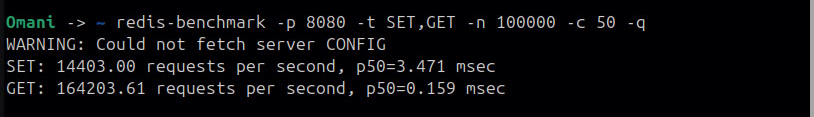
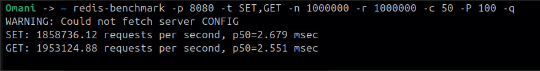
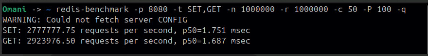
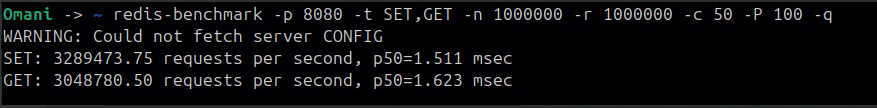
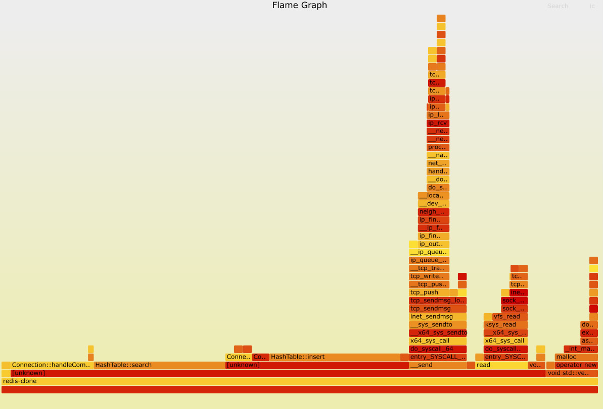

# redis-clone

A zero-dependency, single-threaded key-value store written from scratch in C++17. Built on raw POSIX sockets, epoll, and hand-optimized data structures — no external libraries except jemalloc.

**Benchmark results** (on a single thread, single core):

| Command | Throughput | p50 Latency |
|---------|-----------|-------------|
| SET | 3,289,473 req/sec | 1.51 ms |
| GET | 3,048,780 req/sec | 1.62 ms |

Tested with `redis-benchmark -p 8080 -t SET,GET -n 1000000 -r 1000000 -c 50 -P 100 -q`

---

## Quick Start

### Build from source

```bash
git clone https://github.com/YOUR_USERNAME/redis-clone.git
cd redis-clone
mkdir -p build && cd build
cmake .. && make
./redis-clone
```

### Docker

```bash
docker build -t redis-clone .
docker run -p 8080:8080 redis-clone
```

### Test it

```bash
redis-cli -p 8080
127.0.0.1:8080> SET mykey hello
OK
127.0.0.1:8080> GET mykey
"hello"
```

### Run the benchmark yourself

```bash
redis-benchmark -p 8080 -t SET,GET -n 1000000 -r 1000000 -c 50 -P 100 -q
```

---

## Architecture

The server is structured around five core components:

```
main.cpp
  └── Server          (TCP socket setup, connection management)
       ├── EventLoop   (epoll wrapper, edge-triggered I/O)
       ├── Connection   (per-client state, RESP parsing, command dispatch)
       └── HashTable    (cache-line aligned open-addressing table)
```

### Hash Table

Each node in the table is exactly 64 bytes, aligned to fit a single CPU L1 cache line using `alignas(64)`. This avoids false sharing and cache line splits during lookups.

```cpp
struct alignas(64) KvNode {
    uint64_t key[4];         // 4 FNV-1a hashed keys
    std::string* value[4];   // 4 value pointers
};
```

- **Hash function**: FNV-1a (64-bit) for fast, well-distributed hashing
- **Collision strategy**: Open addressing with linear probing — cache-friendly sequential access
- **Key updates**: Existing keys are detected and updated in-place, freeing old values
- **Memory tracking**: Tracks current heap usage, rejects inserts above a configurable limit

### RESP Parser (Zero-Copy)

The parser reads RESP protocol directly from the read buffer using `std::string_view` — no bytes are copied during parsing. Combined with manual digit parsing (no `stoi` overhead), this keeps the parsing path allocation-free.

Incomplete messages are handled correctly: the cursor is rolled back and the partial data stays in the buffer until the next `read()` completes it.

### Write Batching

Instead of calling `send()` after every command, responses are appended to a write buffer and flushed once per event loop cycle. This reduces syscall overhead significantly — a single `send()` can carry hundreds of responses.

### Networking

- Non-blocking sockets with `epoll` (edge-triggered)
- One shared `HashTable` instance accessed by all connections
- Single-threaded event loop (no locks, no contention)

---

## Performance Journey

These numbers were measured on the same machine across the development process. Each bottleneck was identified using `perf record` profiling, not guesswork.

| Change | SET (req/sec) | What was found |
|--------|--------------|----------------|
| Initial implementation | 10,370 | `cout` on every request: I/O syscalls dominated |
| Removed debug prints | 14,403 | `HashTable::insert` at 95% CPU (perf) — table too small, linear probing degraded |
| Write batching | 643,915 | Reduced per-command `send()` syscalls |
| `string_view` parser | 1,858,736 | Eliminated all allocation from the parsing path |
| jemalloc + compiler opts | 3,289,473 | Final tuning with jemalloc and `-O3` |

### Before optimization: 14K req/sec



### After write batching + string_view: 1.85M req/sec



### After jemalloc: 2.77M req/sec



### Final result: 3.28M req/sec



### Flame Graph (perf)



---

## Project Structure

```
redis-clone/
├── main.cpp            Entry point
├── Server.hpp/cpp      TCP server, socket setup, event dispatch
├── EventLoop.hpp/cpp   epoll wrapper
├── Connection.hpp/cpp  Per-client state, RESP parser, command handler
├── HashTable.hpp/cpp   Cache-aligned hash table with linear probing
├── Utils.hpp           Helper utilities
├── CMakeLists.txt      Build configuration
├── Dockerfile          Multi-stage container build
└── demo/               Visual demo application
    ├── server.js        Node.js proxy (HTTP → RESP)
    └── index.html       Interactive web interface
```

---

## Supported Commands

| Command | Description |
|---------|-------------|
| `SET key value` | Store a key-value pair |
| `GET key` | Retrieve a value by key |

More commands (DEL, EXPIRE, TTL, INCR) are planned.

---

## Dependencies

- C++17 compiler (GCC 10+ or Clang 12+)
- CMake 3.16+
- Linux (epoll is Linux-specific)
- jemalloc (linked at build time)

---
